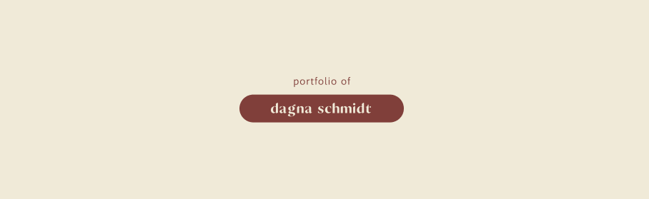
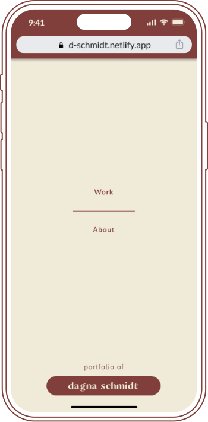
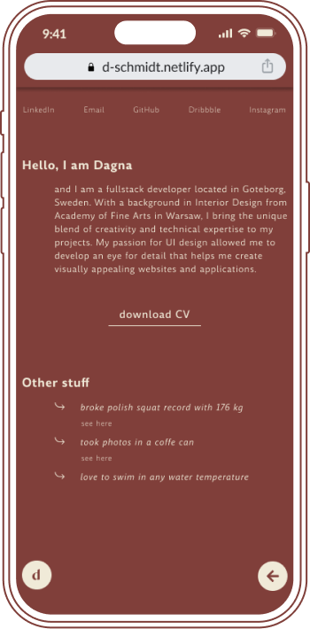
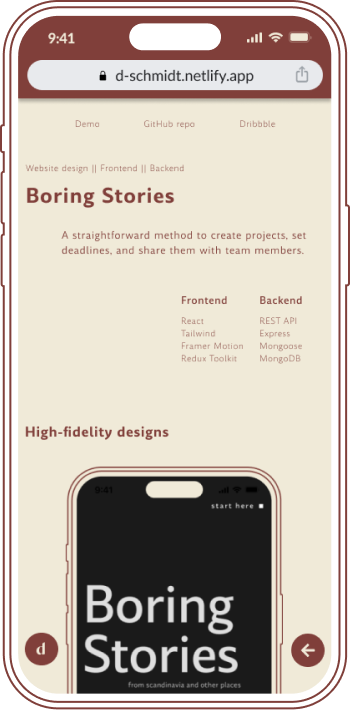

[![Stargazers][stars-shield]][stars-url]
[![LinkedIn][linkedin-shield]][linkedin-url]
    

 

    

  <h3 align="center">Fullstack Developer Portfolio - v4</h3>

  

     
     
    <a href="https://dschmidt.netlify.app/">View Demo</a>
    ·
    <a href="https://dribbble.com/shots/23010524-Boring-Stories-UI">View UI design</a>
  

## About The Project

 

    
    
    

 

Fourth version of my portfolio. 

I aimed for clean and intuitive design.

(<a href="#readme-top">back to top</a>)

### Built With

<h5>UI design</h5>

![Figma]

<h5>Frontend</h5>

![React]
![Redux]
![Tailwind]
![Framer]

<h5>Deployed</h5>

![Netlify]

(<a href="#readme-top">back to top</a>)

<!-- MARKDOWN LINKS & IMAGES -->
<!-- https://www.markdownguide.org/basic-syntax/#reference-style-links -->
[stars-shield]: https://img.shields.io/github/stars/DagnaSchmidt/boring-stories.svg?style=for-the-badge
[stars-url]: https://github.com/DagnaSchmidt/boring-stories/stargazers
[linkedin-shield]: https://img.shields.io/badge/-LinkedIn-black.svg?style=for-the-badge&logo=linkedin&colorB=555
[linkedin-url]: https://linkedin.com/in/dagna-schmidt-90ba37207
[Figma]: https://img.shields.io/badge/Figma-F24E1E?style=for-the-badge&logo=figma&logoColor=white
[React]: https://img.shields.io/badge/React-20232A?style=for-the-badge&logo=react&logoColor=61DAFB
[Redux]: https://img.shields.io/badge/Redux-593D88?style=for-the-badge&logo=redux&logoColor=white
[Tailwind]: https://img.shields.io/badge/Tailwind_CSS-38B2AC?style=for-the-badge&logo=tailwind-css&logoColor=white
[Framer]: https://img.shields.io/badge/Framer-black?style=for-the-badge&logo=framer&logoColor=blue
[Netlify]: https://img.shields.io/badge/Netlify-00C7B7?style=for-the-badge&logo=netlify&logoColor=white
